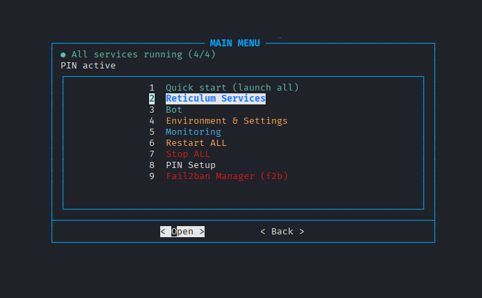
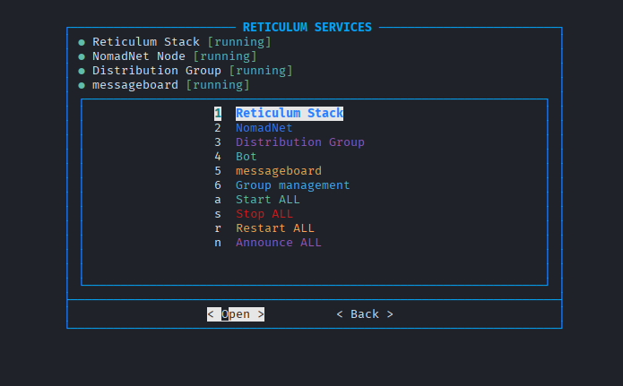
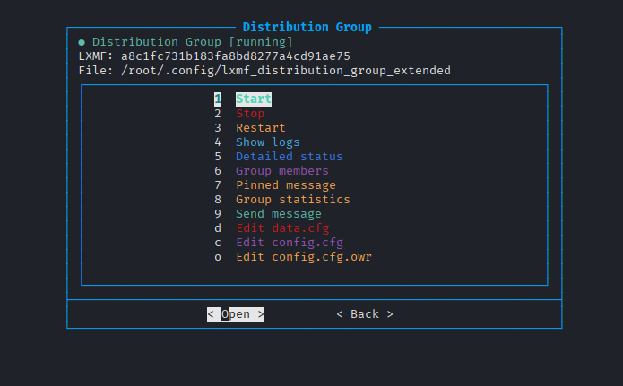
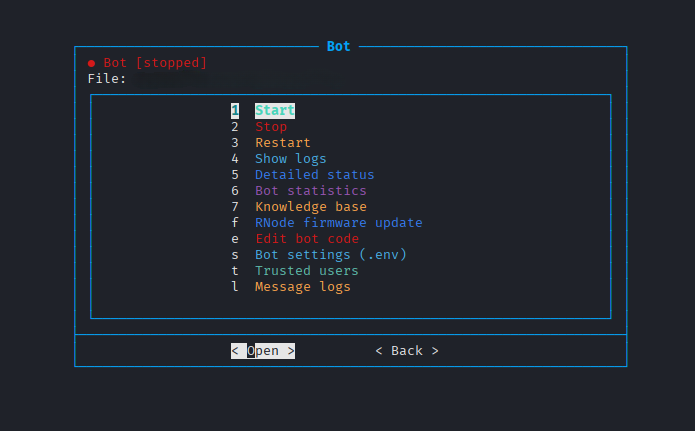
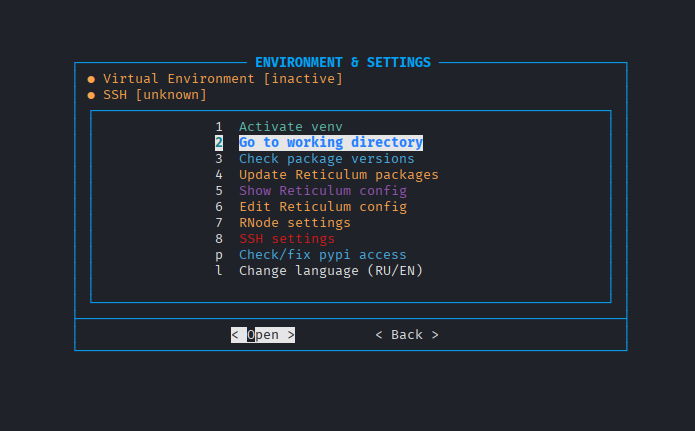
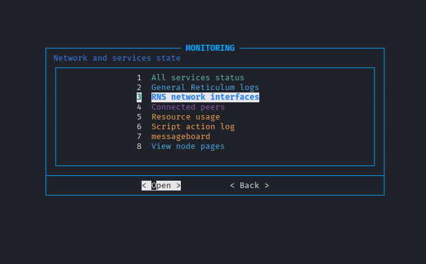
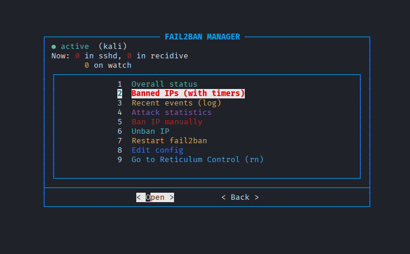

# Reticulum Node Stack

**A complete, self-hosted node for the [Reticulum](https://reticulum.network/) mesh network — installed and managed with a single command.**

Reticulum is an encrypted networking stack that runs over anything: LoRa radios, packet radio, WiFi, or plain TCP/IP over the internet. It needs no central servers, no DNS, no IP addresses — every node is reachable by a cryptographic identity, and messages find their way through whatever links exist.

This project turns a fresh Linux machine into a **full-featured Reticulum node**: a propagation node that relays traffic for others, an AI assistant you can message over the network, moderated distribution groups, a message board, and a single interactive tool that manages all of it. One installer sets everything up; one tool (`rn`) runs it.



---

## What you get

Running the installer gives you a working node with all of these services wired together and starting automatically on boot:

- **Reticulum transport & propagation node** — relays traffic for other nodes and stores messages for offline peers, so the network keeps working even when recipients are unreachable.
- **AI bot over LXMF** (example: *SurgutBot86*) — an assistant powered by a local Ollama model (`gemma2:9b`). You message it from any Reticulum client and it answers over the mesh, with its own knowledge base about Reticulum, RNode, antennas, and more.
- **LXMF distribution groups** — moderated broadcast groups (public or private) where one message is delivered to every member through the group's own identity, online instantly and offline via the propagation node.
- **NomadNet propagation node + pages** — serves `.mu` micron pages and shared files, and carries messages for the wider network.
- **Message board** — a lightweight board that attaches to the shared Reticulum instance instead of spawning its own.

Everything is controlled through two interactive terminal tools:

- **`rn`** — the main manager. Start/stop/restart every service, watch live logs, edit configs inline, manage groups and the bot's knowledge base, poll RNode radios, switch interface language, all behind an optional PIN.
- **`f2b`** — a Fail2ban manager with the same look and feel: live ban status, banned-IP timers, attack statistics, and recidive-jail support to keep SSH brute-force under control.

---

## Screenshots

| | |
|---|---|
| **Main menu** — service health at a glance | **Reticulum Services** — every service with live status |
|  |  |
| **Distribution Group** — LXMF address & controls | **Bot** — AI assistant management |
|  |  |
| **Environment & Settings** | **Monitoring** — network & service state |
|  |  |
| **Fail2ban Manager (`f2b`)** | |
|  | |

---

## Install

### Supported systems

The installer detects your distribution and uses the right package manager automatically:

- **Debian family** (`apt`) — Debian, Ubuntu, **Kali**, **HiveOS**, Raspberry Pi OS, Linux Mint, Pop!\_OS, and other derivatives.
- **Alt Linux** (`apt-get`).

Tested on **Kali Linux** and on **HiveOS** — a permanent production node runs there. So if you already have a GPU mining rig on HiveOS, you can host a full Reticulum node and the AI bot right on the same machine, using the GPU you already own.

Arch, Fedora, and other non-`apt` distributions are not auto-installed, but the stack itself is distribution-agnostic — follow the manual guide in [`docs/deployment.md`](docs/deployment.md) and adapt the package-install step to your package manager.

### One-command install

The recommended way is the automated installer. On a fresh machine:

```bash
git clone https://github.com/Shah-man/reticulum-node-stack.git
cd reticulum-node-stack
chmod +x installret.sh
sudo ./installret.sh
```

The installer walks you through language choice, detects your user, installs the latest Reticulum stack (`rns`, `nomadnet`, `lxmf`) from PyPI, lays down configs, generates and enables all systemd services, and installs the `rn` / `f2b` management tools. When it finishes, just run:

```bash
rn
```

The AI bot is optional and can be added during installation (it needs a GPU — see requirements below).

> **Prefer to do it by hand?** A full step-by-step manual deployment — system preparation, installing Reticulum, placing configs and units, first startup, identity restoration, and security hardening — lives in **[`docs/deployment.md`](docs/deployment.md)**.
>
> Note: the manual guide is for people who want to understand and control every step. Reticulum evolves, so exact package versions and commands there can drift over time — the automated installer always pulls the current release. If anything in the manual guide looks out of date, cross-check against the [official Reticulum documentation](https://reticulum.network/manual/).

---

## Uninstall

To remove the stack:

```bash
sudo ./installret.sh --uninstall
```

This stops and removes all services, scripts, the virtual environment, and runtime data. **Before deleting anything, it automatically backs up your identity keys** — the cryptographic files that define your node's, groups', and bot's addresses on the network. These are irreplaceable: lose them and your node comes back with a brand-new address.

The backup is written to `/root/reticulum-backup-<timestamp>.tar.gz` (owner-only, `chmod 600`), and the installer prints exactly how to inspect, restore, or delete it. To bring your old addresses back after reinstalling:

```bash
# 1) install the stack again
sudo ./installret.sh
# 2) restore the keys (-v lists what's restored)
sudo tar -xvzf /root/reticulum-backup-<timestamp>.tar.gz -C /
# 3) restart so services pick up the restored identities
rn  →  Restart ALL
```

---

## Identity & backups

In Reticulum, your address on the network is derived from an **identity** — a small cryptographic key file. Your node, each group, and the bot all have their own. These keys are what make you *you* on the mesh: lose them, and everything comes back with a new address that nobody recognizes.

This stack treats them carefully:

- Identity files are **never** committed to the repository (excluded via `.gitignore`).
- On uninstall, all identities are **automatically backed up** before anything is deleted (see [Uninstall](#uninstall) above).
- After reinstalling, restoring the backup brings back your original addresses, so peers, groups, and the bot keep the same identity they always had.

## What's in the repository

### `installret.sh`
The one-command installer / uninstaller. Bilingual (English / Russian), portable across users, with automatic identity backup on removal.

### `scripts/`
The management tools installed to `/usr/local/bin`:
- **`rn`** — main interactive stack manager (PIN protection, instant ESC navigation, inline editing of knowledge base and group configs, live logs, dynamic service and group status).
- **`f2b`** — interactive Fail2ban manager with SQLite stats and recidive-jail support.
- **`fetch-rnode-firmware.sh`** — RNode firmware synchronization with selective updates and versioned backups.

### `systemd/`
Unit files for service auto-start: the AI bot (Ollama + LXMF), the message board, the NomadNet propagation node, and the Ollama server.

### `configs/`
Reference configurations (without identity files or runtime state) for the main node, the bot's Reticulum instance, and the NomadNet propagation node.

### `ollama-bot/`
The AI assistant (example: **SurgutBot86**) — a local `gemma2:9b` model on the LXMF network, with a knowledge base, group management, and whitelist-based access control. Ships a `config.example.env` template; your real `.env` is never committed.

### `lxmf-group/`
The extended LXMF distribution-group server (public and private groups).

### `nomadnet-pages/` & `messageboard/`
Propagation-node `.mu` pages plus shared files, and the customized message board that attaches to the shared Reticulum instance.

---

## Requirements

The core node (Reticulum, propagation, groups, board, management tools) is light and runs on almost anything, including a Raspberry Pi.

The **AI bot** is the demanding part and is optional:

- **GPU**: NVIDIA with ≥ 10 GB VRAM (`gemma2:9b` uses ~8–9 GB; tested on an RTX 4090). If you run a mining rig, the card you already have is very likely enough. CPU-only works but expect ~30–120 s per reply — not recommended for live use.
- **RAM**: 16 GB minimum, 32 GB recommended when running the bot.
- **Disk**: ~20 GB free (model + stack + room for logs and propagation cache to grow).
- **Network**: a static public IP is strongly recommended for the propagation node and TCP peering.

---

## Security

- All identity files and secrets are excluded from the repository via `.gitignore`.
- The bot's `.env` is **never** committed — only a template is provided.
- The `rn` tool can require a PIN for destructive actions (editing configs, updating packages, changing SSH).
- `f2b` manages Fail2ban with a recidive jail to throttle repeat SSH offenders.
- On uninstall, identity keys are backed up (owner-only) before any deletion.

---

## Tech stack

- **Reticulum Network Stack (RNS)** — encrypted mesh transport
- **LXMF** — messaging + extended distribution groups
- **NomadNet** — propagation node + pages
- **Ollama** + `gemma2:9b` — local LLM backend for the bot
- **Python 3** — runtime
- **Fail2ban** + custom manager
- **Bash** — installer and management tooling

The installer always pulls the current release of the Reticulum components from PyPI, so a fresh install is always up to date.

---

## Versioning

This project follows [Semantic Versioning](https://semver.org/). See [`CHANGELOG.md`](CHANGELOG.md) for the full release history.
