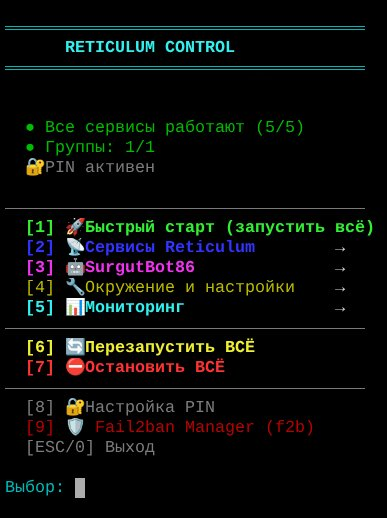
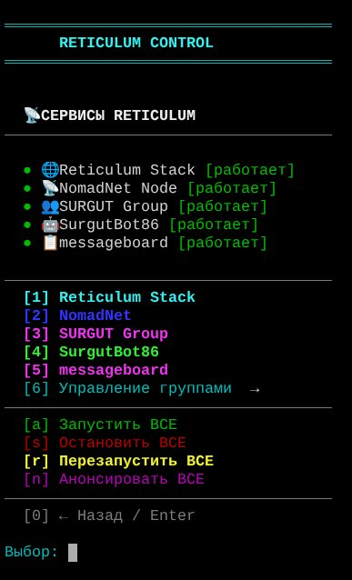
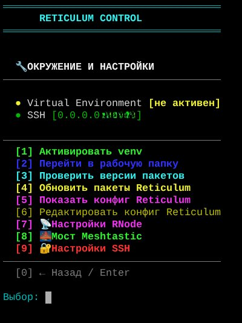
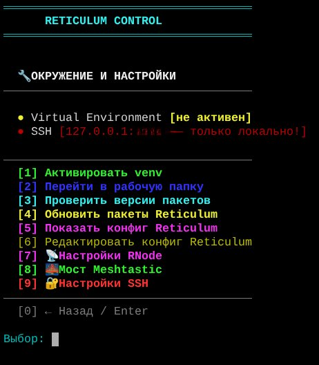
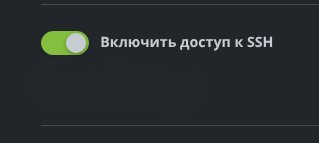

# Reticulum Node Stack Deployment

---

## Table of Contents

1. [Purpose and scope](#1-purpose-and-scope)
2. [Requirements](#2-requirements)
3. [System preparation](#3-system-preparation)
4. [Cloning the repository](#4-cloning-the-repository)
5. [Installing Reticulum (RNS)](#5-installing-reticulum-rns)
6. [Installing Ollama and SurgutBot86 (optional)](#6-installing-ollama-and-surgutbot86-optional)
7. [Placing configs](#7-placing-configs)
8. [Placing service code](#8-placing-service-code)
9. [Installing systemd units](#9-installing-systemd-units)
10. [Installing management scripts](#10-installing-management-scripts)
11. [First startup](#11-first-startup)
12. [Health check](#12-health-check)
13. [Restoring identity from backup](#13-restoring-identity-from-backup)
14. [Security](#14-security)
15. [What's next](#15-whats-next)

---

# 1. Purpose and scope

This document describes deploying a complete Reticulum node stack on a new machine from scratch. The stack is **not just an `rnsd` installation**: it is an integrated set of services and management tools, production-ready.

## What's included in the stack

**Network core (required):**
- `rnsd` — Reticulum Network Stack daemon
- NomadNet propagation node — LXMF message delivery for offline nodes
- LXMF group — group chat over Reticulum
- Message Board — public message board

**Management and operations (required):**

`rn` — unified TUI for the stack. Main menu:



Capabilities:
- **Service management:** start/stop/restart each service individually and all together (with correct startup order and race-condition handling); forced announce
- **Monitoring:** service status, general logs, RNS network interfaces, connected peers, resource usage (CPU/RAM), action log
- **Reticulum core:** view and edit `~/.reticulum/config`, view installed package versions, **update Reticulum packages** (`rns`, `nomadnet`, `lxmf`) with one click
- **NomadNet:** interactive management, toggling `announce_startup`, viewing config
- **Message board:** service management, viewing messages, forced announce, **banning and unbanning spammers** by LXMF address, list of blocked addresses, statistics
- **LXMF groups:** creating/deleting/renaming groups (public and private), managing trusted/admin/mod/user, viewing members, wait list, editing group config files
- **SurgutBot86:** service management, statistics
- **RNode firmware updates** via integrated `fetch-rnode-firmware.sh`
- **Security:** PIN protection for critical operations, log of all actions

"Reticulum Services" submenu:



Additional tools:
- `f2b` — fail2ban manager on SQLite (available both from the `rn` menu and as a separate command) for controlling SSH brute-force attacks
- `fetch-rnode-firmware.sh` — automatic download of latest RNode firmware from Mark Qvist's official repository

**Optional AI bot SurgutBot86:**

LXMF bot based on Ollama. **Requires GPU** for acceptable speed. Without it, the stack works fully.

Capabilities:
- **AI dialog** with message history and built-in Reticulum knowledge base (including instructions for configuring LoRa radio interfaces and flashing RNode devices)
- **Information commands** — accurate time in any city worldwide, weather and 3-day forecast (in Russian and English)
- **File service** — distribution of current RNode firmware on demand
- **LXMF group management** — creating public and private groups, renaming, changing privacy, deletion (trusted access required)
- **Session control** — clearing dialog history, full session reset

Full list of bot commands — in section 6.

## Target OS

Primary platform — **Debian 11/12, Ubuntu 20.04/22.04/24.04**.

**HiveOS** — deploys without modifications (based on Ubuntu). A natural choice for mining servers: Ollama uses spare GPU resources without interfering with mining.

**Kali Linux** — identical to Debian.

**Other distributions** (Alt Linux, Fedora, Arch) — will run, but you'll need to adapt package installation commands and system group names (for example, `dialout` for USB access).

## Minimum hardware requirements

- **Without the bot:** Raspberry Pi 4 (2GB RAM) or any VPS — sufficient
- **With the bot:** a machine with GPU (NVIDIA with at least 8GB VRAM recommended for gemma2:9b)

## What this document does NOT cover

- Configuration of LoRa radio interfaces in `~/.reticulum/config` (see official Reticulum documentation)
- Installation of user LXMF clients — these are client applications, not server-side
- Restoring identity files from backup after data loss — briefly in section 13, in detail in `recovery.md`

---

# 2. Requirements

## Operating system

- Debian 11/12, Ubuntu 20.04/22.04/24.04 (or derivatives: HiveOS, Kali Linux)
- Architecture: x86_64 or arm64

## Hardware

**Minimum (without the bot):**
- 1 CPU
- 1 GB RAM
- 10 GB free disk space

**Recommended (with the SurgutBot86 bot):**
- 4 CPU
- 16 GB RAM
- 50 GB free disk space
- NVIDIA GPU with at least 8 GB VRAM (for gemma2:9b)

## Access

- Root access to the machine (via `sudo` or direct root SSH)
- Permanent internet connection for installing packages and updates

## Network ports

| Port | Protocol | Purpose | Required |
|------|----------|---------|----------|
| 4242 | TCP | TCPInterface for Reticulum (incoming connections from other nodes) | Yes, if the node is public |
| 22 (or non-standard) | TCP | SSH access to the server | Yes |

Port 4242 must be open on the router and in the firewall if the node serves as an entry point for other network participants. For a purely client node, this port is not needed.

## LoRa radio (optional)

If a LoRa interface via an RNode device is planned:
- USB port for connecting the device
- The user running `rnsd` must be in the `dialout` group
- Flashing the device itself is a separate procedure — see the `rn` menu ("RNode firmware update") or the official documentation

## What is NOT required

- A domain name — the node works on a bare IP
- TLS certificate — Reticulum uses its own end-to-end encryption
- External database — the stack is self-contained
- Containerization (Docker) — the stack is installed natively via systemd

---

# 3. System preparation

All commands are run as root. If working as a regular user — add `sudo` before each command.

## Updating the system

```bash
apt update && apt upgrade -y
```

## Installing base packages

```bash
apt install -y \
    git \
    curl \
    wget \
    python3 \
    python3-pip \
    python3-venv \
    build-essential \
    nano \
    sqlite3 \
    fail2ban \
    ufw
```

**What and why:**
- `git` — cloning the stack repository
- `curl`, `wget` — downloading RNode firmware and the Ollama installer
- `python3`, `pip`, `venv` — for Reticulum, the bot, and related scripts
- `build-essential` — compiling Python dependencies with native code
- `nano` — built-in editor for editing configs from `rn`
- `sqlite3` — required by the `f2b` script (fail2ban manager on SQLite)
- `fail2ban` — protection against SSH brute-force
- `ufw` — simple firewall

## Timezone

A correct timezone is important for logs and the announce schedule:

```bash
timedatectl set-timezone <your_timezone>
```

For example: `timedatectl set-timezone Asia/Yekaterinburg`

You can check with: `timedatectl status`

## USB access for RNode (if LoRa is used)

```bash
usermod -a -G dialout root
```

If `rnsd` is run by another user — substitute their name instead of `root`. After adding to the group, a re-login is required.

## Verification

```bash
python3 --version    # must be 3.9+
git --version
pip3 --version
```

All three commands should complete without errors.

---

# 4. Cloning the repository

The stack is deployed from a public repository. All subsequent commands assume you are in `/root/`.

## Cloning

```bash
cd /root
git clone https://github.com/Shah-man/reticulum-node-stack.git
cd reticulum-node-stack
```

## Verifying the structure

```bash
ls -la
```

You should see the following directories:

- `scripts/` — management scripts (`rn`, `f2b`, `fetch-rnode-firmware.sh`)
- `systemd/` — service units for all stack components
- `configs/` — configs for Reticulum and NomadNet
- `ollama-bot/` — code for the SurgutBot86 AI bot (optional)
- `lxmf-group/` — code for the LXMF group
- `messageboard/` — code for the message board
- `nomadnet-pages/` — templates for NomadNet pages

And files:

- `README.md`
- `CHANGELOG.md`
- `.gitignore`

## Further paths in the document

Throughout the rest of the document, `<repo>` refers to `/root/reticulum-node-stack/`.

If you cloned the repository elsewhere — substitute your path instead of `<repo>` in the commands.

---

# 5. Installing Reticulum (RNS)

Reticulum, NomadNet, and LXMF are installed into an isolated Python venv. This allows updating them independently of system packages and avoiding version conflicts.

## Creating the venv

```bash
python3 -m venv /home/user/reticulum
```

> The path `/home/user/reticulum` is used in all systemd units and in the `rn` script. If you change it — you must edit the units and the `VENV_PATH` constant at the beginning of `rn`.

## Installing packages (latest versions from PyPI)

```bash
/home/user/reticulum/bin/pip install --upgrade pip
/home/user/reticulum/bin/pip install --upgrade rns nomadnet lxmf
```

The `--upgrade` flag ensures installation of the very latest versions published by Mark Qvist. This is a deliberate stack policy — always run the most current code with the latest security fixes.

## Verification

```bash
/home/user/reticulum/bin/rnsd --version
/home/user/reticulum/bin/nomadnet --version
/home/user/reticulum/bin/rnstatus --version
```

All three commands should return a version number without errors.

## Initial Reticulum initialization

The first startup creates a default config and the node's identity:

```bash
/home/user/reticulum/bin/rnsd &
sleep 5
kill %1
```

After this, a `/root/.reticulum/` directory will appear with a basic `config` and identity file. This default config will be replaced by ours in section 7.

## How to invoke Reticulum tools

All RNS tools (`rnsd`, `rnstatus`, `rnpath`, `rnprobe`, `rnodeconf`) and NomadNet are installed inside the venv `/home/user/reticulum`. They can be called from the terminal in two ways:

**Full path (recommended for documentation and scripts):**

`/home/user/reticulum/bin/rnstatus`

**With the venv activated (convenient for interactive work):**

```bash
source /home/user/reticulum/bin/activate
rnstatus
```

> Activating the venv is not required when running via systemd — the `.service` files contain full paths. So `systemctl start reticulum.service` always works without activating the venv.

Throughout the rest of this document, Reticulum commands are given with the full path — so they can be copied without first activating the venv.

## Updating in the future

After deployment, updating Reticulum, NomadNet, and LXMF can be done with one click through `rn`: menu item **"Reticulum Services" → "Update packages"**. This will run the same `pip install --upgrade rns nomadnet lxmf` command automatically.

---

# 6. Installing Ollama and SurgutBot86 (optional)

This section is needed only if you plan to deploy the SurgutBot86 AI bot. Without it, the stack works fully — go straight to section 7.

## Installing Ollama

The official installer:

```bash
curl -fsSL https://ollama.com/install.sh | sh
```

The installer automatically:
- Downloads the Ollama binary
- Creates the `ollama.service` systemd unit
- Enables autostart
- Detects the NVIDIA GPU and configures CUDA acceleration

## GPU verification

```bash
ollama --version
nvidia-smi
```

The `nvidia-smi` command should display the video card and driver. If it's not available or the GPU is not detected — Ollama will run on the CPU, but the bot's response speed will become unacceptable for practical use.

## Downloading the model

By default the bot uses `gemma2:9b`:

```bash
ollama pull gemma2:9b
```

The download is ~5.4 GB. The model is saved in `/usr/share/ollama/.ollama/`.

You can use another model — the name is set in the bot's `.env` (section 7), but `gemma2:9b` is recommended as a proven configuration.

## Installing the bot's code

The bot's code is already in the repository. Copy it to its working location and create a venv:

```bash
cp -r <repo>/ollama-bot /home/user/ollama-bot
cd /home/user/ollama-bot
python3 -m venv venv
./venv/bin/pip install --upgrade pip
./venv/bin/pip install -r requirements.txt
```

## Full list of SurgutBot86 commands

After installing the bot, users can interact with it through any LXMF client. Commands:

**Communication and session:**

| Command | Action |
|---------|--------|
| `/clear` | Clear dialog history |
| `/reset` | Full session reset |
| `/model` | Show the active Ollama model |
| `/info` | Bot information |
| `/help` or `/?` | List of commands |

**Information:**

| Command | Action |
|---------|--------|
| `/время <city>` | Accurate time in a city (RU) |
| `/time <city>` | The same in English |
| `/метео <city>` | Weather and 3-day forecast (RU) |
| `/meteo <city>` | The same in English |

**Files (RNode firmware):**

| Command | Action |
|---------|--------|
| `/files` | List of available firmware |
| `/get <name>` | Download firmware |

**LXMF group management** (trusted access required):

| Command | Action |
|---------|--------|
| `/groups` | List of groups (private ones are visible only to owners) |
| `/group <name>` | Group information |
| `/newgroup <name>` | Create a public group |
| `/newgroup <name> private` | Create a private group |
| `/delgroup <name>` | Delete a group |
| `/renamegroup <old> \| <new>` | Rename |
| `/setprivate <name>` | Make private |
| `/setpublic <name>` | Make public |

All other messages that do not start with a slash are processed as a regular AI dialog with Ollama.

**Owner commands** (only for the owner hash set in `.env`):

| Command | Action |
|---------|--------|
| `/adminhelp` | Show help for all owner commands directly in the LXMF client |
| `/trust <hash>` | Add a user to the whitelist (trusted) |
| `/untrust <hash>` | Remove from the whitelist |
| `/trusted` | List of trusted users |
| `/stats` | Bot statistics (users, messages, DAU, groups) |
| `/status` | Ollama status |
| `/models` | List of available models |
| `/setmodel <model>` | Change the active model |
| `/clearall` | Clear histories of all users |

The owner hash is set in the bot's `.env` via the `ADMIN_HASHES` variable (section 7). One owner or several separated by commas can be specified.

The `/adminhelp` command is a built-in cheat sheet: it shows all admin commands in the chat so they can be quickly recalled from any LXMF client.

## Knowledge base

The directory `<repo>/ollama-bot/knowledge/` contains a built-in Reticulum knowledge base: instructions for configuring LoRa radio interfaces, flashing RNode devices, typical scenarios. The bot uses it as context when answering questions on the topic.

RNode firmware files are placed in `<repo>/ollama-bot/knowledge/files/` and automatically appear in the `/files` output. Firmware updates — via `rn` ("RNode firmware update") or the `fetch-rnode-firmware.sh` script directly.

## Creating the bot's .env

Bot configuration — in the next section (7), together with the other stack configs.

---

# 7. Placing configs

## Architecture: one shared instance

The stack uses a **shared instance architecture**: one `rnsd` instance (running as root) holds all network interfaces (TCP servers and clients, AutoInterface, RNode/LoRa), and all other services (NomadNet, messageboard, LXMF group, SurgutBot86) connect to this shared instance via `share_instance = Yes`.

This gives:
- **One port 4242** for the whole node — no conflicts
- **One RNode** — the device doesn't need to be reconnected between services
- **Less memory** — TCP connections with peers are held only by `rnsd`
- **Correct announce** — through a single Transport Instance

That is why there are two Reticulum configs in the repository:

| Config | Purpose |
|--------|---------|
| `configs/reticulum-root/config` | Main — with interfaces, for `rnsd` |
| `configs/reticulum-user/config` | Client — without interfaces, for services |

## Placing Reticulum configs

```bash
# Main config (for rnsd, runs as root)
cp <repo>/configs/reticulum-root/config /root/.reticulum/config

# Client config (for the bot and other user services)
mkdir -p /home/user/.reticulum
cp <repo>/configs/reticulum-user/config /home/user/.reticulum/config
chown -R user:user /home/user/.reticulum
```

## Placing the NomadNet config

```bash
mkdir -p /root/.nomadnetwork
cp <repo>/configs/nomadnet/config /root/.nomadnetwork/config
```

## Customizing for your node

The configs in the repository are a **working template from a live production node**. After copying, edit them for your installation:

### `/root/.reticulum/config`

Open and check the `[interfaces]` section:

- **`[[TCP Server]]`** — the port on which your node accepts incoming connections from other nodes. Default is 4242. Change only if there is a good reason (port conflict, ISP specifics)
- **`[[RNode LoRa ...]]`** — LoRa radio settings (port `/dev/ttyACM*`, frequency, power, spreading factor). If RNode is not used — comment out the section or set `interface_enabled = False`
- **TCP clients to other nodes** — keep those you want to connect to, remove the rest

### `/home/user/.reticulum/config`

This file **must contain** `share_instance = Yes` and **must not contain** its own interfaces. If editing — keep only what's needed:

```
[reticulum]
  share_instance = Yes
  instance_name = default
```

### `/root/.nomadnetwork/config`

This is where the NomadNet propagation node is configured:
- `display_name` — the node name that others will see
- `enable_propagation` — must be `Yes`
- Other parameters can be left as is

## Creating the bot's .env (if SurgutBot86 is installed)

If you don't plan to install the bot — skip this step.

```bash
nano /home/user/ollama-bot/.env
```

Minimum content:

```
BOT_NAME=YourBotName
ADMIN_HASHES=<your_LXMF_hash_from_client>
OLLAMA_URL=http://localhost:11434
OLLAMA_MODEL=gemma2:9b
MAX_HISTORY=20
ANNOUNCE_INTERVAL=900
RATE_LIMIT=5
COOLDOWN=30
PROPAGATION_NODE=<propagation_node_hash>
```

**Where to get `ADMIN_HASHES`:** this is the LXMF address of your main client (NomadNet, or any other). It's found in the client itself — usually in the "Identity" or "Address" section. Owner commands (`/adminhelp`, `/trust`, `/stats`, etc.) will be available from this address.

**`PROPAGATION_NODE`** — the hash of the propagation node through which the bot will receive messages. This is usually your own NomadNet node (the hash will appear after the first NomadNet startup, see section 11).

## What we do NOT copy from the repository

Identity files. They are not in the repository (excluded by `.gitignore`) and should not be — these are node secrets. When deploying from scratch, they are created automatically on first startup. For migration — see section 13.

---

# 8. Placing service code

The code for all services is in the repository. Let's distribute it to working directories from where systemd units will run them.

## Required components

### NomadNet pages (propagation node pages)

```bash
mkdir -p /root/.nomadnetwork/storage/pages
mkdir -p /root/.nomadnetwork/storage/files
cp -r <repo>/nomadnet-pages/pages/* /root/.nomadnetwork/storage/pages/
cp -r <repo>/nomadnet-pages/files/* /root/.nomadnetwork/storage/files/
```

These are `.mu` pages (micron format) that visitors to the node see through any NomadNet client: index, guide, message board, etc. Under the `files/` directory are files available for download through the node.

### LXMF group

```bash
mkdir -p /home/user/reticulum
cp <repo>/lxmf-group/lxmf_distribution_group_extended.py \
   /home/user/reticulum/
```

This is the group backend. The same script runs with different configs for different groups — each group = a separate systemd service with the `-p /path/to/config` flag. Group configs (with identity and member lists) are created on first startup and are not in the repository.

### Message board

```bash
cp <repo>/messageboard/messageboard.py /home/user/reticulum/
```

This is a customized version of the message board, connecting to the shared `rnsd` instance (see section 7). It does not create its own TCP connections and does not grab port 4242.

## Optional component

### SurgutBot86

If the bot is being deployed, its code has already been copied to `/home/user/ollama-bot/` in section 6. Additionally:

```bash
mkdir -p /home/user/ollama-bot/knowledge/files
```

This directory is where `fetch-rnode-firmware.sh` will download RNode firmware. It will automatically appear in the bot's `/files` and `/get` output.

## Permissions

Services run by the `user` account must have access to their directories:

```bash
chown -R user:user /home/user/reticulum
chown -R user:user /home/user/ollama-bot   # if the bot is installed
```

Services run by root (NomadNet, messageboard, rnsd) already work with a privileged user — permissions don't need to be configured.

## Verification

```bash
ls /home/user/reticulum/
ls /root/.nomadnetwork/storage/pages/
```

The first directory should contain `lxmf_distribution_group_extended.py` and `messageboard.py`. The second — `.mu` page files (at least `index.mu`).

---

# 9. Installing systemd units

Systemd units provide auto-startup of services at system boot and automatic restart on failures.

## Units in the repository

Four units are located in `<repo>/systemd/`:

| Unit | Service | Run |
|------|---------|-----|
| `nomadnet.service` | NomadNet propagation node | Required |
| `messageboard.service` | Message board | Required |
| `surgutbot86.service` | SurgutBot86 (AI bot) | Optional |
| `ollama.service` | Ollama (LLM backend) | Optional |

> The unit for `rnsd` (`reticulum.service`) is not in the repository — it is created manually and depends on the venv path. It will be described below.
>
> The LXMF group unit (`surgut_group.service`) is also not in the repository: it is created automatically by the bot when running `/newgroup` (if SurgutBot86 is installed), or manually (if the bot is not installed).

## Copying ready-made units

```bash
cp <repo>/systemd/nomadnet.service /etc/systemd/system/
cp <repo>/systemd/messageboard.service /etc/systemd/system/

# Only if the bot is installed:
cp <repo>/systemd/surgutbot86.service /etc/systemd/system/
```

> `ollama.service` is already installed automatically when running `curl ... install.sh` in section 6, so it doesn't need to be copied.

## Creating reticulum.service

This unit runs `rnsd` as root and must start **before** all other stack services.

```bash
cat > /etc/systemd/system/reticulum.service <<'EOF'
[Unit]
Description=Reticulum Network Stack
After=network.target

[Service]
Type=simple
ExecStart=/home/user/reticulum/bin/rnsd
Restart=on-failure
RestartSec=5

[Install]
WantedBy=multi-user.target
EOF
```

## Creating surgut_group.service (if the bot is not installed)

If SurgutBot86 is being installed — skip this step, the unit will be created automatically.

If the bot is not being installed, but an LXMF group is needed — create the unit manually. First, set up the group config:

```bash
mkdir -p /root/.config/lxmf_distribution_group_extended
```

Then create the unit:

```bash
cat > /etc/systemd/system/surgut_group.service <<'EOF'
[Unit]
Description=LXMF Group: SURGUT GROUP
After=network.target reticulum.service

[Service]
Type=simple
User=root
WorkingDirectory=/home/user/reticulum
ExecStart=/home/user/reticulum/bin/python3 /home/user/reticulum/lxmf_distribution_group_extended.py -p /root/.config/lxmf_distribution_group_extended
Restart=always
RestartSec=10

[Install]
WantedBy=multi-user.target
EOF
```

Replace the group name (`SURGUT GROUP`) and the config path with your own.

## Enabling units

```bash
systemctl daemon-reload

systemctl enable reticulum.service
systemctl enable nomadnet.service
systemctl enable messageboard.service

# Only if the bot is installed:
systemctl enable surgutbot86.service
systemctl enable ollama.service     # already enabled by the installer, but just in case

# If the LXMF group was created manually:
systemctl enable surgut_group.service
```

The `enable` command only turns on autostart at system boot — the services themselves are not yet started. Starting them — in section 11.

## Verification

```bash
systemctl list-unit-files | grep -E "reticulum|nomadnet|messageboard|surgut|ollama"
```

All required units should be in `enabled` status.

## What's not in this section

**fail2ban** — SSH protection against brute-force. Uses the standard packaged unit `fail2ban.service` (installed via `apt`, see section 3). Requires `jail.local` configuration and a small systemd-override for the recidive-jail to work correctly after reboot — described in section 14 (Security).

The `f2b` script from the repository is an SQLite-based manager on top of a running fail2ban, its installation — in section 10 (Installing management scripts).

---

# 10. Installing management scripts

There are three bash scripts in the repository for managing the stack. All are installed to `/usr/local/bin/` so they can be called by short names from anywhere.

## Installation

```bash
cp <repo>/scripts/rn /usr/local/bin/rn
cp <repo>/scripts/f2b /usr/local/bin/f2b
cp <repo>/scripts/fetch-rnode-firmware.sh /usr/local/bin/fetch-rnode-firmware.sh

chmod +x /usr/local/bin/rn /usr/local/bin/f2b /usr/local/bin/fetch-rnode-firmware.sh
```

After that, the scripts are available from any point in the system:

```bash
rn       # main TUI of the stack
f2b      # fail2ban manager
fetch-rnode-firmware.sh --help   # firmware update
```

## Configuring SSH_PORT in the rn script

At the beginning of the `rn` file there is a `SSH_PORT` variable:

```bash
SSH_PORT=<your_port>
```

Replace `<your_port>` with your real SSH port (the one you use / chose in section 14). Without this, the SSH status indicator in the `rn` menu will show the wrong port.

Open the file:

```bash
nano /usr/local/bin/rn
```

Find the line `SSH_PORT=<your_port>` (it's at the very beginning, among the other variables), edit it and save.

## What each script does

### `rn` — main stack TUI

A single point of management for all services and configs. A detailed description of the functionality is in section 1.

Simply invoked:

```bash
rn
```

Supports the Russian keyboard layout: `кт` is recognized as `rn`.

### `f2b` — fail2ban manager

An interactive TUI for managing fail2ban based on SQLite. Shows ban statistics, active jails, allows manually banning/unbanning addresses, works with the recidive-jail. Available as a separate `f2b` command and as a menu item in `rn`.

> For `f2b` to work, fail2ban must be installed and configured — see section 14 (Security).

### `fetch-rnode-firmware.sh` — RNode firmware update

Automatically downloads fresh RNode firmware from Mark Qvist's official repository (`markqvist/RNode_Firmware`). Supports modes:

```bash
fetch-rnode-firmware.sh              # update all (with backup of old ones)
fetch-rnode-firmware.sh t114 tbeam   # only the specified devices
fetch-rnode-firmware.sh --missing    # download missing ones
fetch-rnode-firmware.sh --list       # show what's on disk
fetch-rnode-firmware.sh --no-overwrite   # don't overwrite existing ones
fetch-rnode-firmware.sh --help       # help
```

Before overwriting, old firmware is saved to `.old/` next to the current ones.

Firmware is placed in `/home/user/ollama-bot/knowledge/files/`. If the bot is not installed — the directory must be created manually (or change the path at the beginning of the script). With the bot present, new firmware automatically appears in `/files` and `/get` output.

This script is also called from `rn` via the "RNode firmware update" menu item — no need to remember the arguments.

## PIN setup (optional, but recommended)

The `rn` script supports PIN protection for critical operations (stopping services, banning addresses, deleting groups). On first run, `rn` will offer to set a PIN, or it can be configured later through the "PIN settings" menu.

The PIN is stored in `~/.config/rn/pin` as a hash (not in plain text).

---

# 11. First startup

The startup order is critical: `rnsd` must be ready first so that other services can connect to it through the shared instance.

## Starting services manually

```bash
systemctl start reticulum.service
sleep 4
systemctl start nomadnet.service
systemctl start messageboard.service
```

If the bot is installed:

```bash
systemctl start ollama.service
systemctl start surgutbot86.service
```

If the LXMF group was created manually (without the bot):

```bash
systemctl start surgut_group.service
```

> **The 4-second pause after `reticulum.service` is mandatory.** This is an empirically chosen value that guarantees `rnsd` will have time to initialize the shared instance before the other services connect. At a 3-second pause, NomadNet periodically fails to connect in time and crashes; at 4 — stable. Less than 4 cannot be set.

## Recommended way: through rn

The `rn` script already knows the correct order and pauses — its `restart_all` function starts services in the right sequence and automatically pauses after `reticulum.service`. This is more reliable than manual startup, especially for restarts in production.

After installing the scripts (section 10), we start:

```bash
rn
```

In the menu select **"[1] Quick start"** (if the services have not been started yet) or **"[6] Restart ALL"** (if they are already running).

## What happens during the first startup

- **`rnsd`** creates the node identity in `/root/.reticulum/storage/identities/` and brings up all configured interfaces (TCP, AutoInterface, RNode/LoRa)
- **`nomadnet`** creates the propagation node identity in `/root/.nomadnetwork/storage/identity` and starts receiving LXMF messages. A line with the node's address will appear in the logs — this hash is needed for `PROPAGATION_NODE` in the bot's `.env` (section 7)
- **`messageboard`** creates an identity in `/root/.nomadmb/storage/identity` and starts receiving messages for the board
- **`surgutbot86`** (if installed) creates an identity in `/home/user/ollama-bot/config/identity` and announces itself to the network
- **`surgut_group`** (if installed) creates an identity in `/root/.config/lxmf_distribution_group_extended/identity`

## Getting node hashes

After the first startup, node addresses can be viewed in the logs:

```bash
journalctl -u nomadnet.service -n 50 | grep -i "address\|identity"
journalctl -u messageboard.service -n 50 | grep -i "address\|identity"
journalctl -u surgutbot86.service -n 50 | grep -i "address\|identity"
```

These addresses will be needed for:
- Connecting other network participants to your propagation node
- Reaching the message board and the bot from LXMF clients
- Filling in `PROPAGATION_NODE` in the bot's `.env` if it wasn't set in advance

## If the bot does not receive messages

If `PROPAGATION_NODE` in `.env` is empty or specified incorrectly, the bot will not be able to receive offline messages. Get the NomadNet node hash from the logs and put it in `.env`:

```bash
nano /home/user/ollama-bot/.env
```

After editing, restart the bot:

```bash
systemctl restart surgutbot86.service
```

## Verification

All services should be `active (running)`:

```bash
systemctl status reticulum.service nomadnet.service messageboard.service --no-pager | grep Active
```

If the bot is installed:

```bash
systemctl status ollama.service surgutbot86.service --no-pager | grep Active
```

A detailed health check — in section 12.

---

# 12. Health check

After the first startup, we need to make sure the node is actually working: visible on the network, receiving messages, responding to requests.

## Check via rn

Start `rn` — the main menu immediately shows the status of all services:


It should show **5/5 services running** (or 4/4, if the bot wasn't installed). If at least one is marked as `[not running]` — view the logs through the menu "[5] Monitoring" → "[2] General logs".

## Checking the Reticulum state

In the `rn` menu select "[5] Monitoring" → "[3] RNS network interfaces". Or manually:

```bash
/home/user/reticulum/bin/rnstatus
```

What should be in the output:

- **AutoInterface[Default Interface]** — `Up`
- **TCPServerInterface** (if enabled) — `Up`, on the right port
- **TCPClientInterface[...]** to other nodes — desirably `Up` at least for some
- **RNodeInterface** (if LoRa is used) — `Up`, with temperature and airtime
- **Transport Instance** — must be running, showing the hash and uptime

If at the very bottom it says `Transport Instance <hash> running` — this means the shared instance is working correctly, and all dependent services can connect to it.

## Checking the LXMF network

In the `rn` menu "[5] Monitoring" → "[4] Connected peers" will show who is currently connected to your TCP node. If you just deployed — the list may be empty, this is normal: peers need time to discover your node through announce.

## Test message to the bot

If SurgutBot86 is installed — the most reliable test is to write to it from any LXMF client.

1. In the client add the bot's LXMF address (visible in the logs: see section 11 "Getting node hashes")
2. Send any message, for example: `Hello`
3. A reply should arrive within 5–30 seconds (depending on the GPU and delivery path)

If there is no reply — check:

```bash
journalctl -u surgutbot86.service -n 50 --no-pager
journalctl -u ollama.service -n 20 --no-pager
```

In the bot's logs there should be lines `[INFO] Received message from ...` and `[INFO] Sent reply to ...`. If they are not there — the message didn't arrive (a problem with PROPAGATION_NODE in `.env` or with the network).

## Test message to the board

If `messageboard.service` is installed:

1. Get the board's address from the logs (`journalctl -u messageboard.service | grep -i address`)
2. Send a message from any LXMF client
3. A confirmation should arrive in response
4. Visit your NomadNet node through any client → page `board.mu` — your message should be visible

You can also view through `rn`: "[5] Monitoring" → ... → or through the messageboard submenu ("View messages").

## Checking announce

A few minutes after startup, your node should announce itself on the network. This is visible in the logs:

```bash
journalctl -u nomadnet.service | grep -i "announce" | tail -5
```

There should be lines like `Sent announce for ...`.

You can also check from another node (via any LXMF client) — your address should appear in the list of known destinations within a few minutes.

## Advanced connectivity diagnostics

If announces are visible but messages are not arriving — check whether your node sees a path to the remote destination:

```bash
/home/user/reticulum/bin/rnpath <destination_hash>
```

If it returns `Error: Invalid path data returned` — the path is not known, the node has not received an announce of this destination or its routing table has not yet updated. Wait a few minutes or request the path explicitly.

Ping a remote node:

```bash
/home/user/reticulum/bin/rnprobe <destination_hash>
```

It will show whether the remote node is responding and through how many hops.

> The `rnpath` and `rnprobe` utilities are installed together with the `rns` package and reside in the venv. Run them by full path (`/home/user/reticulum/bin/...`), or activate the venv before use: `source /home/user/reticulum/bin/activate`.

## If something doesn't work

Before fixing — collect diagnostics. `rn` has a convenient item "[5] Monitoring" → "[5] Resource usage" — it shows the CPU/RAM of each service. If some service consumes abnormally much memory or CPU — that's the first thing to look at.

Logs of all services with one command:

```bash
journalctl -u reticulum.service -u nomadnet.service \
           -u messageboard.service -u surgutbot86.service \
           -u surgut_group.service -f --no-pager
```

This same command is available in `rn` via the monitoring item "General logs".

---

# 13. Restoring identity from backup

This section is only needed when **migrating** the node to a new machine or recovering from data loss. When deploying from scratch, it is not required — identity files are created automatically on first startup of services.

## What identity is and why backup matters

Each service in the stack (Reticulum, NomadNet, messageboard, LXMF group, SurgutBot86) has its own **identity file** — a private key based on Curve25519. The service's **LXMF address** on the network depends on it.

Loss of identity = loss of address. The node or group will change its hash, and all network participants will see you as a new user, without history and connections. The address book of other participants will become invalid.

That is why identity files are **the main thing to back up** on a working node, even before any failures. By themselves they weigh kilobytes.

## There can be two migration scenarios

**Scenario A — clean new machine.** Services have never been started. Go through the steps below in order: there's nothing to stop (skip step 1), create directories, place identity from backup, start services.

**Scenario B — services have already been started** and created "new" identities. In this case step 1 (stopping services) is mandatory. Step 2 (creating directories) can be skipped — they already exist, but `mkdir -p` is safe in this case too. Steps 3–5 are the same: identity from backup will simply overwrite those that the services created on first startup.

## Where identity files are located

The full list of paths that need to be saved and restored:

| Service | Path to identity |
|---------|------------------|
| Reticulum (rnsd) | `/root/.reticulum/storage/identities/` |
| Reticulum (user services) | `/home/user/.reticulum/storage/identities/` |
| NomadNet propagation node | `/root/.nomadnetwork/storage/identity` |
| Message Board | `/root/.nomadmb/storage/identity` |
| LXMF group (SURGUT GROUP) | `/root/.config/lxmf_distribution_group_extended/identity` |
| LXMF group (private) | `/root/.config/lxmf_group_<name>/identity` |
| SurgutBot86 | `/home/user/ollama-bot/config/identity` |

The names of private groups depend on what you called them when creating.

## Restoring: order of actions

**Restoring identity is done BEFORE the first startup of services** on the new machine. If services have already been started — they created their own identities, these files need to be overwritten with the ones restored from backup.

### 1. Stop all services (if they are already running)

```bash
systemctl stop surgutbot86.service messageboard.service \
              nomadnet.service surgut_group.service reticulum.service
```

### 2. Create the required directories

```bash
mkdir -p /root/.reticulum/storage/identities
mkdir -p /home/user/.reticulum/storage/identities
mkdir -p /root/.nomadnetwork/storage
mkdir -p /root/.nomadmb/storage
mkdir -p /root/.config/lxmf_distribution_group_extended
mkdir -p /home/user/ollama-bot/config
```

### 3. Copy identity files from the backup

Specific commands depend on the backup format. Example for a tar archive:

```bash
tar -xzf identity_backup.tar.gz -C /tmp/restore
cp /tmp/restore/root/.reticulum/storage/identities/* /root/.reticulum/storage/identities/
cp /tmp/restore/root/.nomadnetwork/storage/identity /root/.nomadnetwork/storage/
cp /tmp/restore/root/.nomadmb/storage/identity /root/.nomadmb/storage/
cp /tmp/restore/root/.config/lxmf_distribution_group_extended/identity /root/.config/lxmf_distribution_group_extended/
cp /tmp/restore/home/user/.reticulum/storage/identities/* /home/user/.reticulum/storage/identities/
cp /tmp/restore/home/user/ollama-bot/config/identity /home/user/ollama-bot/config/
```

### 4. Set the correct owners

```bash
chown -R user:user /home/user/.reticulum
chown -R user:user /home/user/ollama-bot
```

Files under `/root/` remain owned by root — this is normal.

### 5. Start services as usual (see section 11)

The services will pick up the restored identities and announce themselves on the network with your previous addresses.

## Verification

After starting, compare the hashes with those that were before migration:

```bash
journalctl -u nomadnet.service -n 50 | grep -i address
journalctl -u messageboard.service -n 50 | grep -i address
journalctl -u surgutbot86.service -n 50 | grep -i address
```

The addresses should **match** those you had on the old machine. If they do not match — an identity was not restored somewhere, look for the error in the paths.

## More details

A detailed guide on backup and recovery (including what else to back up besides identity — group configs, message board database, bot database) — in a separate document `docs/recovery.md`.

---

# 14. Security

The Reticulum stack uses built-in end-to-end encryption, so LXMF messages themselves are cryptographically protected. But the server on which it all runs needs to be protected separately — from SSH brute-force, port scanning, and random attacks.

## SSH

### Changing the port (recommended)

The standard port 22 is continuously scanned by bots. Changing to a non-standard port eliminates 99% of automatic attacks.

Pick a random port from the range 30000–60000. Don't use obvious sequences (`1234`, `4321`) or repeated digits (`11111`, `22222`) — those are scanned too. You can generate a random port with the command:

```bash
echo $((RANDOM % 30000 + 30000))
```

Remember the chosen number — it will be needed in several places. Further in the instructions it is denoted as `<SSH_PORT>`.

Open the SSH config:

```bash
nano /etc/ssh/sshd_config
```

Find the line `#Port 22`, uncomment it, and change to your port:

```
Port <SSH_PORT>
```

Restart SSH:

```bash
systemctl restart ssh
```

> **Important:** before `restart`, open a second SSH window to the server. If the new port doesn't work (firewall, typo, router not configured) — the old session gives you a chance to roll back the changes. Closing the only window and doing a restart, you risk losing access to the server.

### Router port forwarding

If the server is behind NAT (home router, a VPS usually has no NAT) — you need to forward the chosen port from the external IP to the server's internal IP.

In the router admin panel find the **Port Forwarding** section (NAT, Virtual Servers — called differently). Create a rule:

| Parameter | Value |
|-----------|-------|
| External port | `<SSH_PORT>` |
| Internal port | `<SSH_PORT>` |
| Internal IP | the server's IP on the local network (for example, `192.168.1.100`) |
| Protocol | TCP |

Without this rule, SSH will not be accessible from the outside — the port will be "closed" for internet traffic, even if sshd on the server is running correctly.

> The same step is also needed for **port 4242** (Reticulum TCPInterface), if you want other nodes to be able to connect to your node through a public IP.

### Managing SSH through rn

All typical SSH operations are available through `rn` without editing configs manually. In the menu: **"[4] Environment and settings" → "[9] SSH settings"**.

What is available:
- **Current status** — port and listening interface
- **[1]** Editing `sshd_config`
- **[2]** Restarting SSH
- **[3]** sshd status
- **[4]** Viewing current connections

The SSH status indicator is visible directly in the "Environment and settings" submenu. Green means the SSH daemon listens on all interfaces and is reachable from outside:



Red means the SSH daemon is bound to localhost only — external access is closed:



> HiveOS specifics: after rig reboot, the system script `/hive/sbin/remote-connections` may reset `ListenAddress` to `127.0.0.1` — in this case the indicator in `rn` will show local-only, and external access will not work.
>
> Solved through the HiveOS web UI: the **"Enable SSH access"** toggle on the rig settings page. After enabling the toggle, `ListenAddress` returns to `0.0.0.0`, and SSH becomes accessible from outside again:



### Password authentication

The stack is designed for work with password authentication — this gives flexibility for connecting from different devices without transferring keys. To prevent the password from becoming a weak link:

- **Length 16+ characters** with mixed case, digits, and special characters
- **Don't use words and dates** — dictionary attacks are effective against them
- **Don't use the same password** that you use elsewhere
- **Change the password every six months to a year**

Additional protection against brute-force is fail2ban (see below).

> If you prefer SSH key authentication — it is supported as standard, the description is beyond the scope of this documentation. The main thing to remember is that **disabling password login** only makes sense if keys are configured on **all** devices from which you connect.

## fail2ban

This section deploys fail2ban. The package itself was already installed in section 3 (`apt install fail2ban`). Here — configuration.

### jail.local config

`jail.local` is a file with your settings that override the defaults from `jail.conf`. fail2ban recommends doing it this way so that your settings are not overwritten when the package is updated.

```bash
nano /etc/fail2ban/jail.local
```

Minimum content:

```ini
[DEFAULT]
bantime  = 1h
findtime = 30m
maxretry = 3

[sshd]
enabled = true
port    = <SSH_PORT>
logpath = /var/log/auth.log

[recidive]
enabled  = true
logpath  = /var/log/fail2ban.log
filter   = recidive
backend  = auto
bantime  = 1w
findtime = 1d
maxretry = 3
```

What these jails do:

- **`[sshd]`** — bans an IP for 1 hour after 3 failed login attempts within 30 minutes
- **`[recidive]`** — bans "repeat offenders" for 1 week if the IP has been banned 3 times within a day. Protection against those who persistently hammer after the first ban

> If you changed the SSH port to a non-standard one — be sure to specify it in the `port =` line of `[sshd]`, otherwise fail2ban will check the old port 22.

### recidive-jail fix (important)

The recidive-jail reads its own log `/var/log/fail2ban.log`. On the first startup of fail2ban this file does not yet exist, and the service falls with the error `Have not found any log file for recidive jail`.

The solution is to create the file before fail2ban starts via a systemd-override:

```bash
mkdir -p /etc/systemd/system/fail2ban.service.d/
```

```bash
cat > /etc/systemd/system/fail2ban.service.d/override.conf <<'EOF'
[Service]
ExecStartPre=/usr/bin/touch /var/log/fail2ban.log
EOF
```

```bash
systemctl daemon-reload
```

Create the file manually now (for the first startup):

```bash
touch /var/log/fail2ban.log
```

### Starting fail2ban

```bash
systemctl enable fail2ban
systemctl start fail2ban
```

Verification:

```bash
fail2ban-client status
```

Should show both jails:

```
Status
|- Number of jail:      2
`- Jail list:   recidive, sshd
```

If only one (`sshd`) — recidive did not come up, look at the logs:

```bash
journalctl -u fail2ban --since "5 min ago" --no-pager
```

### Working with bans through f2b

The `f2b` script (section 10) provides an interactive TUI over fail2ban: viewing bans, statistics, manual ban/unban, working with recidive. Available as a separate command:

```bash
f2b
```

Or as a menu item in `rn` ("[9] Fail2ban Manager").

## UFW (optional)

If you want an additional layer of protection — set up UFW (Uncomplicated Firewall, already installed in section 3).

A minimal configuration — allow only the necessary ports:

```bash
ufw default deny incoming
ufw default allow outgoing

ufw allow <SSH_PORT>/tcp comment 'SSH'
ufw allow 4242/tcp comment 'Reticulum TCP'

ufw enable
```

> **Important:** before `ufw enable`, double-check that the SSH port is specified correctly. UFW applies the rules immediately upon enabling — a mistake cuts you off from the server.

Verification:

```bash
ufw status numbered
```

## What this section does NOT cover

- DDoS protection at the provider/CDN level
- Regular system updates (`apt update && apt upgrade` — your responsibility, can be automated through `unattended-upgrades`)
- Log audit
- Physical access protection to the server

This is a baseline sufficient for a typical node with a public IP. For more serious scenarios — a separate topic beyond the scope of this documentation.

---

# 15. What's next

The stack is deployed, services are running, the node is visible on the network. What's next — daily operation and maintenance.

## Daily work

**The main tool** is the `rn` script. Everything is available through it:
- Service management (start/stop/restart, forced announce)
- Monitoring (status, logs, interfaces, resources)
- LXMF group and message board management
- Updating Reticulum packages (`rns`, `nomadnet`, `lxmf`)
- Updating RNode firmware
- Managing fail2ban through the integrated `f2b`
- SSH settings

Get used to running `rn` for most tasks — it's safer than manual commands (PIN protection, correct restart order, action log).

## Regular maintenance

**Once every week or two:**
- Run an update of Reticulum packages through `rn` ("Reticulum Services" → "Update packages")
- Check that the versions of `rns`, `nomadnet`, `lxmf` are fresh — Mark Qvist periodically releases updates, among which there are critical security fixes. Timely updating is your responsibility

**Once a month:**
- Update the system: `apt update && apt upgrade`
- Check fail2ban logs: `f2b` → ban statistics. If attacks are growing — your SSH port may have "leaked" and it makes sense to change it
- Back up identity files (see section 13)

**As new versions come out:**
- RNode firmware — through `rn` ("RNode firmware update") or `fetch-rnode-firmware.sh --missing`
- Ollama and models — `ollama pull <model>` (if the bot is installed)

## Identity backup (CRITICAL)

Identity files are the main thing that must not be lost. Loss = loss of the node's LXMF address and all groups.

A minimal backup with one command:

```bash
tar -czf identity_backup_$(date +%Y%m%d).tar.gz \
    /root/.reticulum/storage/identities/ \
    /root/.nomadnetwork/storage/identity \
    /root/.nomadmb/storage/identity \
    /root/.config/lxmf_distribution_group_extended/identity \
    /home/user/.reticulum/storage/identities/ \
    /home/user/ollama-bot/config/identity 2>/dev/null
```

Store the resulting `identity_backup_YYYYMMDD.tar.gz` (a few kilobytes) **off the server** — on a separate disk, in the cloud, on a flash drive. Can be automated through cron — but don't store backups only on the same server, this is pointless in case of disk failure.

A detailed guide on backup and recovery — in `docs/recovery.md`.

## Community and connections

Reticulum is first and foremost a network of people. After deployment:

- Find and add nearby propagation nodes to `~/.reticulum/config` (section `[interfaces]`)
- Register your node on public network maps (for example, rmap.world) if you want others to find you
- Connect to existing LXMF groups or create your own
- Share experience — the stack didn't come together in one evening, and every deployed node makes the network more resilient

## What is NOT described in this documentation

The deployed stack is a baseline. From here on, the specifics of your node begin:

- **LoRa radio and antennas** — choice of frequency, power, antennas, placement (outside the apartment is better than inside)
- **Backup interfaces** — besides TCP, you can add I2P, Yggdrasil for resilience against blocking
- **Customizing NomadNet pages** — `.mu` micron-format, your own board, your own guides
- **Extending the bot** — your own commands, your own knowledge base

These topics are beyond the scope of deployment and require separate guides. The starting point is the official Reticulum documentation and the community.

---

**Good luck with the node. The network grows thanks to people like you.**
